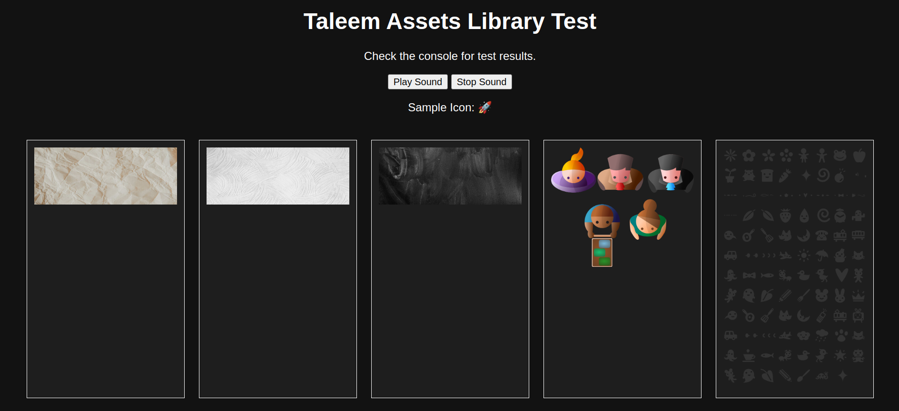

# Taleem Assets Library Documentation

## Overview
Taleem Assets is a utility library for loading background images, sprites, sounds, and general images, along with a collection of icons for use in web applications.

This library is part of libraries created for https://taleem.help.
Ina addition to having integral assets the functions can be used to down load and manage assets.

There are background images  and sprites converted into Base64 format so that moving these images and asset bundle becomes easy.



## Installation
```sh
npm install taleem-assets
```

## Usage
Import the required modules in your project:

```javascript
import { loadBackgroundImages, loadSprites, loadSound, loadImages, Icons } from 'taleem-assets';
```

## Exports and Functions

### `loadBackgroundImages()`
Loads a set of predefined background images and returns them as `Image` objects.

**Usage:**
```javascript
const bgImages = await loadBackgroundImages();
console.log(bgImages); // Array of image objects
```

### `loadSprites()`
Loads predefined sprite sheets and their configurations.

**Usage:**
```javascript
const sprites = await loadSprites();
console.log(sprites); // Array of sprite objects
```

### `loadSound(soundUrl)`
Loads a sound file using `Howler.js` and returns a `Howl` object.

**Usage:**
```javascript
const sound = await loadSound('path/to/sound.mp3');
sound.play();
```

### `loadImages(imagesUrlArray)`
Loads an array of image URLs and returns them as `Image` objects.

**Usage:**
```javascript
const images = await loadImages(['image1.png', 'image2.jpg']);
console.log(images); // Array of loaded image objects
```

### `Icons`
A collection of icon symbols available in the library.

**Usage:**
```javascript
console.log(Icons.BOOK); // 📘
console.log(Icons.ROCKET); // 🚀
```

## License
MIT License.

